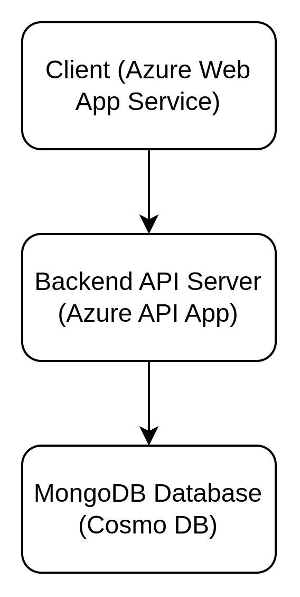
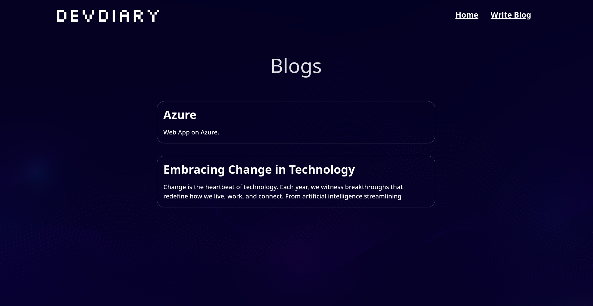
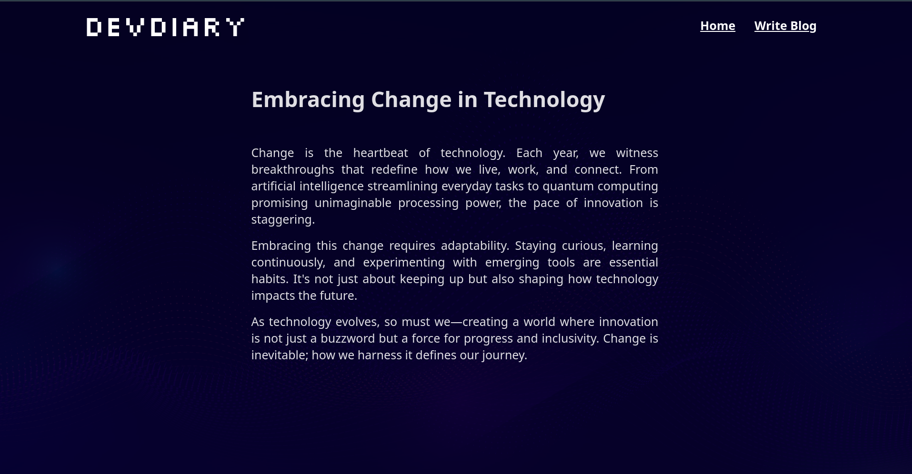
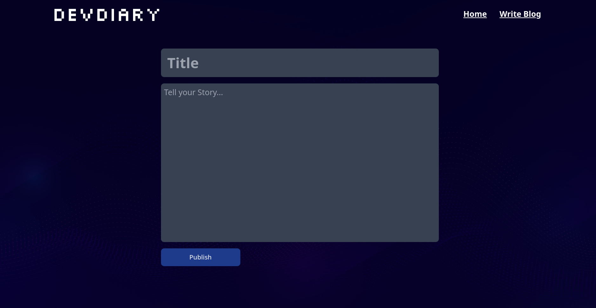

# DevDiary

## Setup instructions
### 1. Installing dependencies
```
    npm i
```

### 2. Run Locally
```
    npm run dev
```

## Deployment process
- Create Azure Account
- Create Resource Group for Client Server Deployment with Azure Web App Service
- From Deployment Center add Github Repository for Continuous Deployment.

## Architecture overview
<p align="center">
    </img>
</p>

## Preview
- Blogs Page

    </img>
    
- Specific Blog Page

    </img>

- Publish Blog Page

    </img>